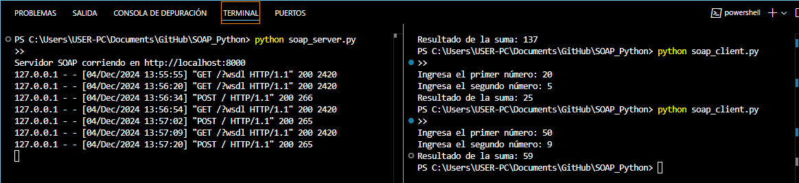

# 🌐 SOAP with Spyne and Zeep - Python

This project demonstrates a SOAP service and client using **Spyne** and **Zeep**. The SOAP service performs a simple addition of two numbers, and the client interacts with the service to perform the calculation.



---

## 🚀 **Technologies Used**  
- **Backend**: Python, Spyne  
- **SOAP Protocol**: Soap11  
- **SOAP Client**: Zeep  

---

## 📖 **Prerequisites**  
Before running this project, make sure you have the following components installed:  
1. **Python 3.10 or later**  
2. **Git**  
3. A text editor such as **Visual Studio Code** (optional). 

---

## 🛠️ **Steps to Set Up and Run the Project**  

### 1️⃣ Clone the Repository  
Use the following command to clone the project from GitHub:  
```
git clone https://github.com/ciizao/SOAP_Python.git
```
### 2️⃣ Navigate to the Project Directory
Create a virtual environment to manage the project dependencies:
 ```
cd SOAP_Python
```
### 3️⃣ Create a Virtual Environment
Create a virtual environment to manage the project dependencies:
 ```
python -m venv venv
```
### 4️⃣ Activate the Virtual Environment
- On **Windows**
 ```
venv\Scripts\activate
```
- On MAC/Linux
 ```
source venv/bin/activate
```
### 5️⃣ Install Dependencies
Use the `requirements.txt` file to install the necessary dependencies:
 ```
pip install -r requirements.txt
```
### 6️⃣Run the SOAP Server
Start the SOAP server with the following command:
 ```
python soap_server.py
```
- The server will run on http://localhost:8000.

### 7️⃣  Run the SOAP Client
In a new terminal window, run the SOAP client:
 ```
python soap_client.py
```
-The client will prompt you to enter two numbers and then display the result of their addition by calling the SOAP service.

## 📂 Repository
* The source code for this project is available on GitHub:

```
https://github.com/ciizao/SOAP_Python.git